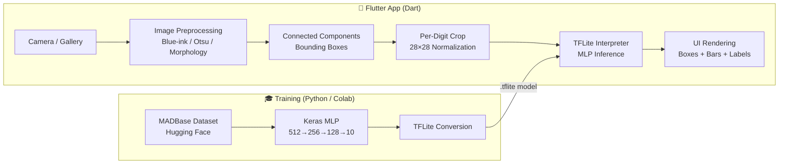

# 🔢 Arabic Digit Recognizer

> A Flutter mobile application for **recognizing handwritten Arabic digits (٠–٩)** using on-device machine learning with TensorFlow Lite.

[](https://flutter.dev)
[](https://dart.dev)
[](https://www.tensorflow.org/lite)
[](https://huggingface.co/datasets/MagedSaeed/MADBase)
[](LICENSE)

---

## 📸 App Screenshots

<p align="center">
  
  &nbsp;&nbsp;&nbsp;
  
</p>

<p align="center">
  <em>Left: Home screen with camera & upload options &nbsp;|&nbsp; Right: Digit "8" detected with 100% confidence + bounding box + probability bars</em>
</p>

---

## 🧪 ML Notebook — Multi-Digit Detection

<p align="center">
  
</p>

<p align="center">
  <em>The Jupyter notebook detecting all 10 Arabic digits (9‑8‑7‑6‑5‑4‑0‑0‑2‑1‑0) from a single handwritten image, with bounding boxes, 28×28 preprocessed patches, and per-digit confidence scores (0.97–1.00).</em>
</p>

---

## ✨ Features

| Feature | Description |
|---------|-------------|
| 📷 **Real-time Camera** | Live camera feed with continuous inference (~400 ms throttle) |
| 🖼️ **Image Upload** | Pick images from gallery or camera roll via `image_picker` |
| 🔍 **Multi-digit Detection** | Detects and classifies multiple digits in a single image |
| 🎯 **Bounding Box Visualization** | Green bounding boxes with per-digit confidence labels |
| 📊 **Probability Bars** | Visual bar chart of all 10 class probabilities |
| 🌙 **Dark Theme UI** | Sleek dark mode interface with cyan/purple accent colors |
| 🔒 **Runtime Permissions** | Camera and storage permissions handled via `permission_handler` |

---

## 🧠 Machine Learning — In Depth

### Dataset

| Property | Value |
|----------|-------|
| **Name** | [MADBase](https://huggingface.co/datasets/MagedSaeed/MADBase) (Modified Arabic Digits Base) |
| **Source** | Hugging Face Datasets |
| **Content** | Handwritten Arabic-Indic digits (٠ ١ ٢ ٣ ٤ ٥ ٦ ٧ ٨ ٩) |
| **Image Size** | 28 × 28 pixels, grayscale |
| **Classes** | 10 (digits 0–9) |
| **Split** | Train + Test (with validation split from training set) |

### Model Architecture

The model is a **Multi-Layer Perceptron (MLP)** — fully connected layers only, no convolutional layers — trained with Keras/TensorFlow and converted to TensorFlow Lite for on-device inference.

```
Input: (1, 28, 28, 1)
    │
    ▼
┌─────────────────────────┐
│  Flatten (784 units)    │
└────────────┬────────────┘
             ▼
┌─────────────────────────┐
│  Dense(512, ReLU)       │
│  Dropout(0.35)          │
└────────────┬────────────┘
             ▼
┌─────────────────────────┐
│  Dense(256, ReLU)       │
│  Dropout(0.25)          │
└────────────┬────────────┘
             ▼
┌─────────────────────────┐
│  Dense(128, ReLU)       │
│  Dropout(0.15)          │
└────────────┬────────────┘
             ▼
┌─────────────────────────┐
│  Dense(10, Softmax)     │
└─────────────────────────┘
    │
    ▼
Output: (1, 10)  →  probability per digit class
```

> **Why MLP instead of CNN?**  
> An MLP flattens the image into a 784-dimensional vector, losing spatial structure. CNNs are typically better for images because convolution layers learn local patterns (edges, strokes). However, an MLP is still effective here because the images are small (28×28), grayscale, centered, and the task has only 10 classes.

### Training Configuration

| Parameter | Value |
|-----------|-------|
| **Optimizer** | Adam |
| **Loss Function** | Categorical Cross-Entropy |
| **Epochs** | 30 (with EarlyStopping) |
| **Batch Size** | 128 |
| **EarlyStopping** | `monitor="val_accuracy"`, `patience=5`, `restore_best_weights=True` |
| **Label Encoding** | One-hot (`to_categorical`, 10 classes) |
| **Normalization** | Pixel values scaled from `[0, 255]` → `[0.0, 1.0]` |

### Evaluation & Metrics

The notebook includes:
- **Training/Validation accuracy & loss curves** over epochs
- **Confusion matrix** heatmap (Seaborn) on the test set
- **Classification report** (precision, recall, F1-score per digit)
- **Random sample verification** — visual comparison of true vs. predicted labels with confidence scores

### Image Preprocessing Pipeline (On-Device)

The app replicates the same preprocessing as the notebook, entirely in Dart — no OpenCV dependency at runtime:

```
Raw Image (Camera / Gallery)
  │
  ▼
┌──────────────────────────────────────────────────────────┐
│  1. Blue-Ink Detection (HSV)                             │
│     H: 85–145°, S ≥ 35/255, V ≥ 30/255                  │
│     → If enough blue pixels found, use blue mask         │
│     → Otherwise, fall back to Otsu thresholding          │
└──────────────────────┬───────────────────────────────────┘
                       ▼
┌──────────────────────────────────────────────────────────┐
│  2. Morphological Operations                             │
│     Erode (2×2 kernel) → Dilate (2×2) → Dilate (2×2)    │
│     → Cleans noise, strengthens digit strokes            │
└──────────────────────┬───────────────────────────────────┘
                       ▼
┌──────────────────────────────────────────────────────────┐
│  3. Connected Component Analysis (Flood Fill)            │
│     → Finds contiguous foreground regions                │
│     → Filters by area, width, height, edge proximity     │
│     → Returns bounding boxes, sorted left-to-right       │
└──────────────────────┬───────────────────────────────────┘
                       ▼
┌──────────────────────────────────────────────────────────┐
│  4. Per-Digit Preprocessing                              │
│     → Crop digit from mask with padding                  │
│     → Center in square → Resize to 20×20                 │
│     → Pad to 28×28 (4px border)                          │
│     → Center by mass (shift centroid to pixel 14,14)     │
│     → Normalize to [0.0, 1.0]                            │
└──────────────────────┬───────────────────────────────────┘
                       ▼
┌──────────────────────────────────────────────────────────┐
│  5. TFLite Inference                                     │
│     → Feed [1, 28, 28, 1] tensor to MLP                  │
│     → Output: 10 softmax probabilities                   │
│     → argmax → predicted digit + confidence              │
└──────────────────────────────────────────────────────────┘
```

### TFLite Model Summary

| Property | Value |
|----------|-------|
| **File** | `assets/model/arabic_digit_mlp_model.tflite` |
| **Size** | ~2.2 MB |
| **Input Shape** | `[1, 28, 28, 1]` (batch, height, width, channel) |
| **Output Shape** | `[1, 10]` (probability per class) |
| **Conversion** | `tf.lite.TFLiteConverter.from_keras_model()` |
| **Training Notebook** | [`Arabic_Digits (1).ipynb`](ML%20Notebook/Arabic_Digits%20(1).ipynb) |

---

## 🏗️ Project Structure

```
ml_bonus/
├── lib/
│   ├── main.dart                          # App entry point & MaterialApp theme
│   ├── screens/
│   │   ├── home_screen.dart               # Image picker UI + single-image inference
│   │   └── camera_screen.dart             # Live camera feed + real-time inference
│   ├── classifier/
│   │   └── digit_classifier.dart          # TFLite model loading, preprocessing & inference
│   └── widgets/
│       └── detected_boxes_view.dart       # Bounding box overlay painter
├── assets/
│   └── model/
│       └── arabic_digit_mlp_model.tflite  # Pre-trained MLP model (~2.2 MB)
├── assets2/                               # Screenshots for documentation
│   ├── App home.png
│   ├── App result.png
│   └── the detection in the ml note book.png
├── ML Notebook/
│   └── Arabic_Digits (1).ipynb            # Full training notebook (Colab/Jupyter)
├── pubspec.yaml
└── README.md
```

---

## 🚀 Getting Started

### Prerequisites

- **Flutter SDK** ≥ 3.0.0 — [Install Flutter](https://docs.flutter.dev/get-started/install)
- **Dart SDK** ≥ 3.0.0 (bundled with Flutter)
- **Android SDK** or **Xcode** for platform builds
- A physical device with a camera (recommended for real-time mode)

### Installation

```bash
# 1. Clone the repository
git clone https://github.com/ebrahim-rabie/ml_bonus.git
cd ml_bonus

# 2. Install dependencies
flutter pub get

# 3. Run on a connected device / emulator
flutter run
```

### Platform-Specific Setup

<details>
<summary><strong>🤖 Android</strong></summary>

- Minimum SDK: check `android/app/build.gradle` for `minSdkVersion`
- Camera and storage permissions are declared in `AndroidManifest.xml`
- Runtime permissions are requested automatically via `permission_handler`

</details>

<details>
<summary><strong>🍎 iOS</strong></summary>

- Camera usage description must be set in `ios/Runner/Info.plist`:
  ```xml
  <key>NSCameraUsageDescription</key>
  <string>This app uses the camera to recognize handwritten Arabic digits.</string>
  ```
- May require ARM64 architecture configuration in Xcode build settings

</details>

---

## 📖 Usage

### Home Screen — Image Mode

1. **Launch the app** → wait for *"Model ready"* indicator (cyan dot)
2. Tap **📷 Take Photo** or **🖼️ Upload Image**
3. Position the handwritten digit(s) clearly (well-lit, dark ink on light paper)
4. The app displays:
   - Detected bounding boxes overlaid on the image
   - The combined digit string (Arabic + Latin)
   - Confidence score for the primary detection
   - Bar chart of all 10 class probabilities

### Camera Screen — Real-Time Mode

1. Navigate to the camera screen
2. Point the camera at handwritten Arabic digits
3. The app runs inference continuously (~2.5 fps) and shows:
   - A scan-frame overlay that changes color based on confidence
   - Live predicted digit (Arabic numerals ٠–٩)
   - Confidence badge in the top-right corner
   - Real-time probability bars

### Reading the Results

| Element | Meaning |
|---------|---------|
| **Arabic Digit** | Predicted digit in Arabic numeral form (٠١٢٣٤٥٦٧٨٩) |
| **Latin Digit** | Same prediction in Western numerals (0–9) |
| **Confidence** | Model's softmax probability (cyan ≥ 80%, orange < 80%) |
| **Probability Bars** | Per-class breakdown — cyan = top prediction, purple = others |
| **Bounding Boxes** | Green rectangles around each detected digit region |

---

## 🏛️ Architecture

### System Overview



### Key Components

| File | Responsibility |
|------|----------------|
| [`main.dart`](lib/main.dart) | App entry, dark theme configuration (`0xFF0A0A0F` background, cyan/purple scheme) |
| [`home_screen.dart`](lib/screens/home_screen.dart) | Image picker integration, single-shot inference, result display |
| [`camera_screen.dart`](lib/screens/camera_screen.dart) | Live camera feed, YUV420→RGB conversion, throttled inference, scan overlay |
| [`digit_classifier.dart`](lib/classifier/digit_classifier.dart) | `ArabicDigitClassifier` class — model loading, image preprocessing, TFLite inference |
| [`detected_boxes_view.dart`](lib/widgets/detected_boxes_view.dart) | `DetectedBoxesPainter` — renders scaled bounding boxes & confidence labels |
| [`Arabic_Digits (1).ipynb`](ML%20Notebook/Arabic_Digits%20(1).ipynb) | Full training pipeline — data loading, model building, training, evaluation, TFLite export |

---

## 📦 Dependencies

| Package | Version | Purpose |
|---------|---------|---------|
| [`tflite_flutter`](https://pub.dev/packages/tflite_flutter) | ^0.11.0 | TensorFlow Lite inference engine |
| [`camera`](https://pub.dev/packages/camera) | ^0.11.0+1 | Live camera feed & image streaming |
| [`image_picker`](https://pub.dev/packages/image_picker) | ^1.0.7 | Gallery & camera image selection |
| [`image`](https://pub.dev/packages/image) | ^4.1.7 | Image decoding, pixel manipulation |
| [`permission_handler`](https://pub.dev/packages/permission_handler) | ^11.3.0 | Runtime permission requests |
| `flutter` | SDK | UI framework |

**Training dependencies** (in the notebook):
`tensorflow`, `numpy`, `matplotlib`, `seaborn`, `opencv-python-headless`, `scikit-learn`, `datasets` (Hugging Face)

---

## 🐛 Troubleshooting

<details>
<summary><strong>Model not loading</strong></summary>

- Verify `assets/model/arabic_digit_mlp_model.tflite` exists
- Check that `pubspec.yaml` declares the asset path under `flutter.assets`
- Run `flutter clean && flutter pub get` and rebuild

</details>

<details>
<summary><strong>Poor prediction accuracy</strong></summary>

- Use dark ink on a light / white background
- Ensure digits are well-lit and clearly separated
- Blue ink is preferred — the classifier has a dedicated blue-ink detection mode (HSV filter)
- Digits should be large enough in the frame (avoid tiny writing in a large image)

</details>

<details>
<summary><strong>Camera permission denied</strong></summary>

- **Android**: Settings → Apps → Arabic Digit Recognizer → Permissions → Camera
- **iOS**: Settings → Privacy → Camera → Arabic Digit Recognizer → Allow

</details>

<details>
<summary><strong>Camera screen shows loading spinner indefinitely</strong></summary>

- Use a **physical device** — many emulators don't support camera image streaming
- Ensure no other app is using the camera
- Check that `camera` package supports your device's API level

</details>

<details>
<summary><strong>Slow inference on emulator</strong></summary>

- TFLite runs significantly slower on emulators — use a real device
- Inference is throttled to every 400 ms in camera mode
- Consider enabling the TFLite GPU delegate for hardware acceleration

</details>

---

## 🔧 Development

### Re-training the Model

1. Open [`ML Notebook/Arabic_Digits (1).ipynb`](ML%20Notebook/Arabic_Digits%20(1).ipynb) in Google Colab or Jupyter
2. The notebook will:
   - Download the MADBase dataset from Hugging Face
   - Train the MLP model with EarlyStopping
   - Show confusion matrix, classification report, and accuracy curves
   - Export both `.keras` and `.tflite` models
3. Replace `assets/model/arabic_digit_mlp_model.tflite` with the new model
4. If input/output shapes change, update constants in [`digit_classifier.dart`](lib/classifier/digit_classifier.dart):
   ```dart
   static const int inputSize = 28;
   static const int digitSize = 20;
   static const bool trainingBackgroundIsWhite = false;
   ```
5. Run `flutter clean && flutter run` and test with diverse samples

### Theme Customization

The dark theme is configured in [`main.dart`](lib/main.dart):

```dart
theme: ThemeData.dark().copyWith(
  scaffoldBackgroundColor: const Color(0xFF0A0A0F),
  colorScheme: const ColorScheme.dark(
    primary: Color(0xFF00E5FF),      // Cyan accent
    secondary: Color(0xFF7C4DFF),    // Purple accent
    surface: Color(0xFF12121A),      // Card / surface color
  ),
)
```

### Camera Inference Tuning

Adjust the inference throttle in [`camera_screen.dart`](lib/screens/camera_screen.dart):

```dart
static const int _inferenceIntervalMs = 400; // Lower = faster, higher = less CPU
```

---

## ⚠️ Known Limitations

- MLP architecture does not capture spatial features (no convolution) — accuracy may be lower than a CNN on edge cases
- Blue-ink detection uses fixed HSV thresholds that may not cover all ink colors
- No support for cursive or connected digit writing
- YUV420→RGB conversion is done on the main thread (may cause frame drops on low-end devices)
- No on-device model retraining or fine-tuning

---

## 🗺️ Roadmap

- [ ] Upgrade to CNN architecture for higher accuracy
- [ ] GPU acceleration via TFLite GPU delegate
- [ ] Isolate-based inference to avoid UI jank
- [ ] Support for Arabic letters (ا–ي) in addition to digits
- [ ] Adaptive thresholding for varied lighting conditions
- [ ] On-device model fine-tuning UI
- [ ] Export prediction history to CSV
- [ ] Unit and integration tests

---

## 📚 Resources

- [TensorFlow Lite Documentation](https://www.tensorflow.org/lite)
- [MADBase Dataset — Hugging Face](https://huggingface.co/datasets/MagedSaeed/MADBase)
- [tflite_flutter — pub.dev](https://pub.dev/packages/tflite_flutter)
- [camera — pub.dev](https://pub.dev/packages/camera)
- [image_picker — pub.dev](https://pub.dev/packages/image_picker)
- [Arabic Numeral Recognition Research](https://scholar.google.com/scholar?q=arabic+handwritten+digit+recognition)

---

## 📄 License

This project is licensed under the [MIT License](LICENSE).

---

<p align="center">
  Built with ❤️ using Flutter & TensorFlow Lite
</p>
